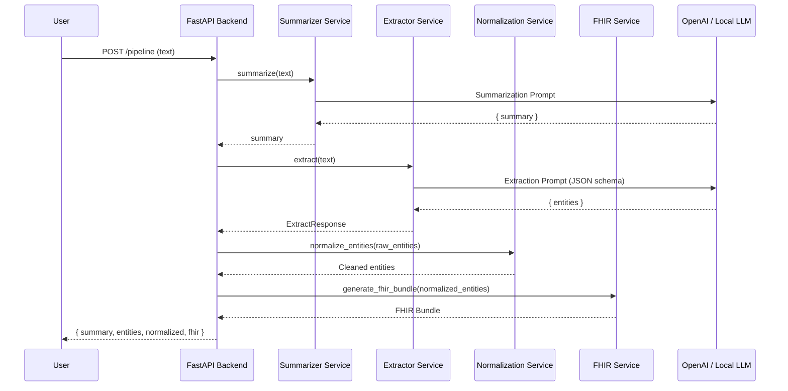
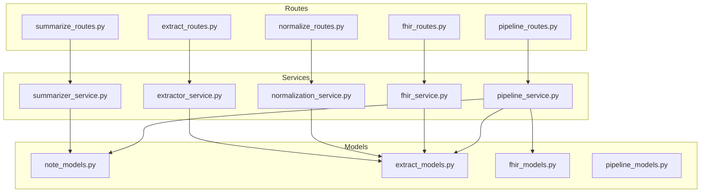

# 🏗️ System Architecture

This document describes how all components in the Doctor Notes App work together.

---

# ⚙️ High-Level Architecture

The backend is composed of four cooperating subsystems:

1. **Summarizer Service** → rewrites raw text into EMR-style summary  
2. **Extractor Service** → extracts structured entities  
3. **Normalization Service** → cleans & standardizes extracted data  
4. **FHIR Service** → generates a FHIR Bundle  

These are orchestrated by `pipeline_service.py`.

---

# 🚦 Pipeline Sequence Diagram

---

# 🧱 Backend Layered Architecture

---

# 🧩 Component Responsibilities

### **Summarizer**
- Converts text → EMR-style summary  
- Extracts basic diagnoses, symptoms, medications  

### **Extractor**
- Runs strict JSON schema extraction  
- Produces deeply structured clinical entities  

### **Normalization**
- Removes noise  
- Ensures entity shape matches Pydantic models  
- Prepares data for FHIR stability  

### **FHIR Generator**
- Creates real, structured, interoperable FHIR resources  
- Outputs full Bundle  

---

# 📍 Design Principles

- **LLM variability → normalization → stable FHIR output**
- Keep services modular & testable
- Allow local or cloud LLMs

---

# ✔️ End of architecture.md
