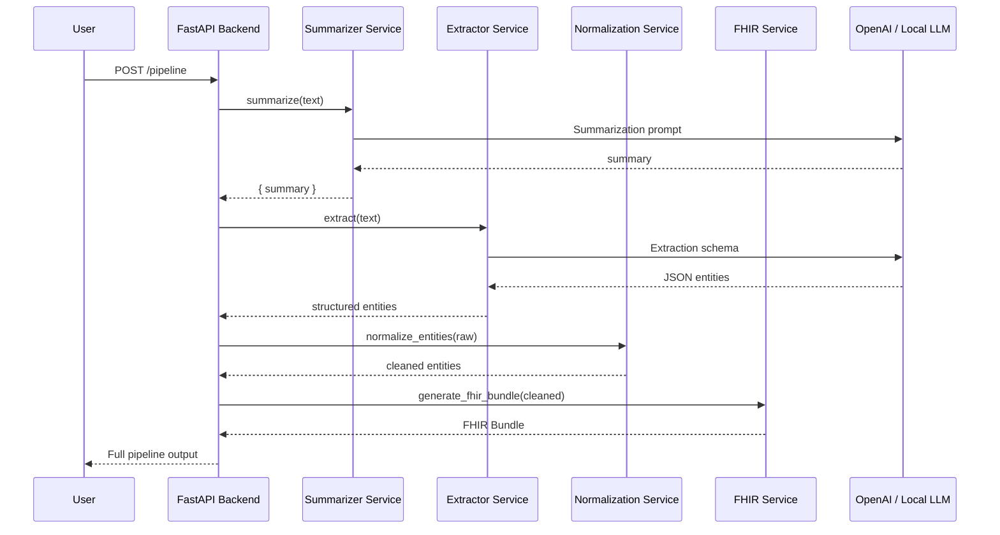

# 🏗️ System Architecture

This document describes how the backend components cooperate to transform unstructured clinical text into a validated, interoperable HL7 FHIR Bundle.

The system is designed to prioritize **clinical correctness, determinism where required, and controlled use of LLMs**.

---

## 🧠 Terminology Coding Strategy (Design Rationale)

This system intentionally applies **different coding strategies** depending on the clinical terminology being mapped, based on how those concepts appear in real-world clinical text and how they are handled in production EHR systems.

### Deterministic Lookup (RxNorm, LOINC)

**RxNorm (medications)** and **LOINC (labs and measurements)** are mapped using normalized string and synonym lookup rather than semantic retrieval.

This is by design:

- Medication and lab names typically appear **explicitly and consistently** in clinical notes
- Surface-form variation is limited and enumerable (brand vs generic, common abbreviations)
- Deterministic lookup provides **higher precision, reproducibility, and auditability**
- Incorrect medication or lab codes are **clinically riskier than missing codes**

For these terminologies, semantic retrieval would add latency and hallucination risk without improving accuracy.

### Semantic Retrieval (SNOMED CT, ICD-10)

**SNOMED CT** and **ICD-10** represent higher-level clinical concepts such as conditions, symptoms, and diagnoses that are frequently **paraphrased, inferred, or context-dependent**.

Examples include:
- “shortness of breath” → “dyspnea”
- “chest tightness on exertion” → “angina”

For these cases, the system uses embedding-based semantic retrieval (RAG-style) to map free-text concepts to standardized codes.

### Alignment with Real Clinical Pipelines

This hybrid strategy mirrors how production healthcare systems operate:

| Terminology | Coding Strategy |
|------------|----------------|
| RxNorm | Deterministic lookup |
| LOINC | Deterministic lookup |
| SNOMED CT | NLP + semantic matching |
| ICD-10 | Concept mapping and rules |

Semantic retrieval is applied **only where ambiguity exists**, reducing hallucination risk while preserving interoperability.

---

## ⚙️ High-Level Architecture

The backend is composed of four cooperating subsystems:

1. **Summarizer Service**  
   Uses an LLM to convert raw encounter text into a concise, EMR-style clinical summary.

2. **Extractor Service**  
   Uses an LLM with a strict JSON schema to extract structured clinical entities.

3. **Normalization Service**  
   Cleans, validates, and stabilizes extracted entities to ensure deterministic downstream processing.

4. **FHIR Service**  
   Converts normalized entities into HL7 FHIR–compliant resources and bundles.

These components are orchestrated by `pipeline_service.py`, which enforces execution order and validation boundaries.

---

## 🚦 Pipeline Sequence Diagram



---

graph TD
        subgraph Routes
                R1[summarize_routes.py]
                R2[extract_routes.py]
                R3[normalize_routes.py]
                R4[fhir_routes.py]
                R5[pipeline_routes.py]
        end

        subgraph Services
                S1[summarizer_service.py]
                S2[extractor_service.py]
                S3[schema_normalization.py]
                S4[fhir_service.py]
                S5[pipeline_service.py]
        end

        subgraph Models
                M1[note_models.py]
                M2[extract_models.py]
                M3[fhir_models.py]
                M4[pipeline_models.py]
        end

        R1 --> S1
        R2 --> S2
        R3 --> S3
        R4 --> S4
        R5 --> S5

        S1 --> M1
        S2 --> M2
        S3 --> M2
        S4 --> M2
        S5 --> M1
        S5 --> M2
        S5 --> M3
```

---

# 🧩 Component Responsibilities

### **Summarizer**
- Converts raw text → summary  
- Extracts high-level details  

### **Extractor**
- Uses strict JSON schema  
- Normalizes missing fields  
- Repairs invalid JSON  

### **Normalization**
- Ensures stable formatting  
- Prepares safe input for FHIR  

### **FHIR Generator**
- Generates HL7-compliant resources  
- Includes SNOMED / ICD-10 / RxNorm / LOINC support  
- Supports RAG semantic coding lookup  

---

# 📍 Design Principles

- LLM → noisy; Normalizer → stable; FHIR → strict
- Keep services modular & testable
- Allow local or cloud LLMs

---

# ✔️ End of architecture.md

