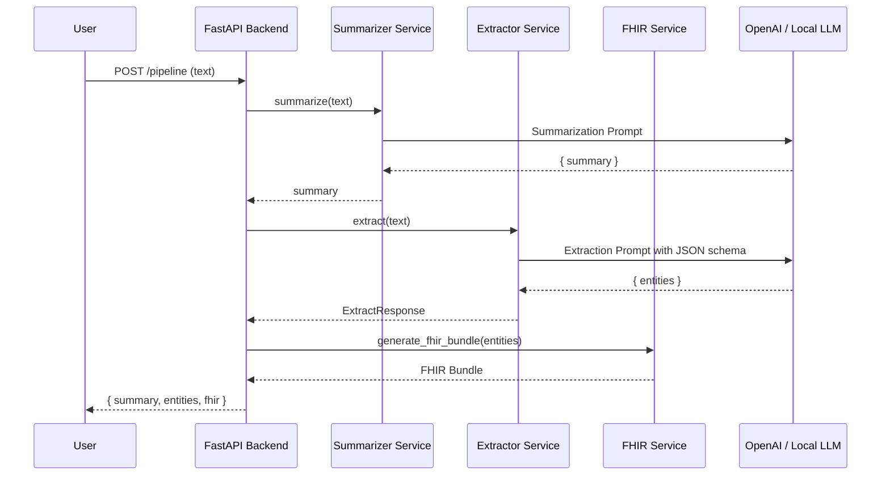
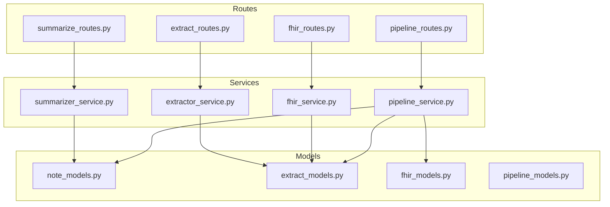

# 🏗️ System Architecture

This document describes the architecture of the **LLM-Powered Clinical Note App**, including backend structure, pipeline design, and how LLMs integrate into the system.

---

## 🧩 High-Level System Components

### **1. Frontend (React – planned)**
- Clinician enters text or uploads audio
- Displays summary, structured entities, and FHIR output

### **2. Backend (FastAPI + Python)**
- `/summarize` — LLM summarization  
- `/extract` — LLM entity extraction  
- `/fhir` — FHIR bundle generation  
- `/pipeline` — summarize → extract → fhir in one call

### **3. External LLM Provider**
- Currently OpenAI API
- Can later support:
  - NVIDIA NIM
  - vLLM
  - Ollama
  - Local models

---

## 🧬 Pipeline Architecture Overview

```
text → summarize → extract → fhir → output
```

---

## 🚦 Pipeline Sequence Diagram



---

## 🧱 Backend Layered Architecture



---

## 🧠 Key Architecture Decisions

### ✔ **Unified Clinical Schema — ExtractResponse**
One schema powers extraction → fhir.  
No duplication, no drift, simple pipeline.

### ✔ **Services return plain dicts**
FastAPI handles validation through `response_model`.

### ✔ **Interchangeable LLM backend**
Only `summarizer_service` and `extractor_service` depend on the LLM provider.

### ✔ **Agent-ready Pipeline**
The `/pipeline` endpoint can later include:
- validation
- error correction
- tool usage
- medical reasoning

---

## 📌 Future Architectural Enhancements
- Add audio → text service
- Add vector DB for guidelines lookup
- Add terminology server integration (Snowstorm)
- Add agentic orchestration layer

