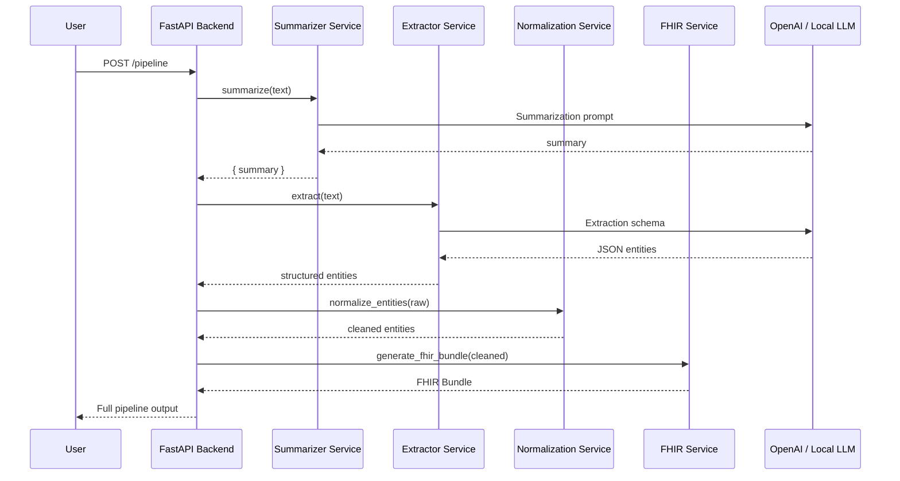
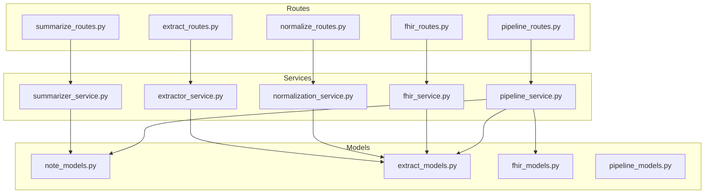

# 🏗️ System Architecture

This file explains how all components in the backend work together.

---

# ⚙️ High-Level Architecture

The backend is composed of four cooperating subsystems:

1. **Summarizer Service** → LLM converts raw text → concise structured summary  
2. **Extractor Service** → LLM extracts structured medical entities in strict JSON  
3. **Normalization Service** → cleans the extracted data and ensures consistency  
4. **FHIR Service** → converts normalized entities → HL7 FHIR Bundle  

These are orchestrated by `pipeline_service.py`.

---

# 🚦 Pipeline Sequence Diagram

---

# 🧱 Backend Layered Architecture

---

# 🧩 Component Responsibilities

### **Summarizer**
- Converts raw text → summary  
- Extracts high-level details  

### **Extractor**
- Uses strict JSON schema  
- Normalizes missing fields  
- Repairs invalid JSON  

### **Normalization**
- Ensures stable formatting  
- Prepares safe input for FHIR  

### **FHIR Generator**
- Generates HL7-compliant resources  
- Includes SNOMED / ICD-10 / RxNorm / LOINC support  
- Supports RAG semantic coding lookup  

---

# 📍 Design Principles

- LLM → noisy; Normalizer → stable; FHIR → strict
- Keep services modular & testable
- Allow local or cloud LLMs

---

# ✔️ End of architecture.md

